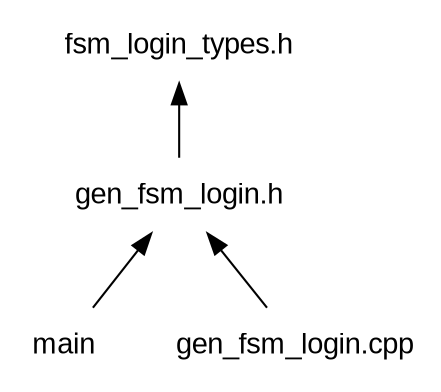

# FSM generator

## Installation

```bash
cargo install -f fsm_gen
```

You can download from repository and build and install as usual

```bash
cargo build --release
cargo install --path . -f
```

## Versions

### 0.7

- Modifs on `cpp` generated code
    - Removed `.reference` files
    - Added `_forwards` files
    - `gen_` at the begining to indicate you souldn't touch
    - `actions` and `guards` using `cpp templates`

### 0.6

- `cpp` generated code with option to move to `error` state
- Instead of `languages`, now we speak about `templates`

### 0.5

- moved to tera templates
- added dot files generation
 
### 0.4

- error redefinied action on cpp (watch example iceberg)
- fix error when running on current directory
- Add full proposed file for hand written .h and .cpp on generated one

### 0.3

- multiline guards with no status name
- multi guard and multi actions
- '\_' on input means any other input
- negative guards
- if no transition, it will generate an error
- updated rust-peg lib and working with macros
- if execption is throwed, we will go to error transition
- better error information
  - on parsing show line
  - check orphans status
- makefile install, test cpp

### 0.2

- Actions
- private hpp (hand file)
- Template functions to specialize on transaction change
- Anonymous `namespace` for functions
- Add comments support on fsm grammar

## TODO

- revisit dot
- check README.md

- Error transition is special
- Inprove exceptions control
- web ui for templates
- read template from file

- Update idata in order to use ispush with btrees and more

- Complete the cpp example and update on README.md
- Check fsm format
  - detect duplicated states
  - detect duplicated inputs and guards
- output with signals

- Add templates

## Aim

All computing processes consist of receiving an input and processing it by generating an output. From the simplest to the most complex.

Sometimes, the process depends on the context and it is necessary to manage a state.

Messages and state management, therefore, are two fundamental elements of any software process.

That's why I wrote two external DSLs long time ago for both elements (which I still use in production and are a great help).

In this repository I rewrite one of them, the code generator for a state machine.

At the moment it generates C++ code (my most immediate target in production).

> You can have data (fields) on inputs structs, and also on each status

To explain the system, I will use the example in [cpp_test/fsm](cpp_test/fsm)

This example is about writing a system that will handle login requests.

First the server will be asked for a password.

This key will be used to encode the username and password (this one will be passed through a hash function) in the login request.

This encoding will be irreversible (hash function). The server will perform the same operation (starting from the hash of the password) to verify the validity.

If it is OK, it will send a login confirmation.

The diagram would look like this:


A list of transitions could be written as:

```peg
//  Example of fsm to manage login
//  on server side

[init]
    rq_key          ->  w_login     /   send_key
    timer           ->  init

[w_login]
    rq_login        ->  login       /   send_login
    timer
        & timeout   ->  error
                    ->  w_login
[login]
    rq_logout       ->  logout      /   send_logout
    heartbeat       ->  login       /   update_hb
    timer
        & timeout   ->  logout
                    ->  login

[logout]
    timer           ->  logout

[error]
    _               ->  error
```

And this is the input for this tool to generate code

In fact, even the previous diagram has been generated from this `DSL` (it generated a `graphviz` dot file)

## Elements

### States

```peg
[init]
    ...
```

**init**, **w_login**, **login** ... are the states

Depending on the input and the state (with its values as will be seen later), the system will change to a new state.

### Transition

```peg
    rq_key                  ->  w_login
```

If we receive an input (in this case `rq_key`) we go to next state (`w_login`)

### Input

The elements received by the status machine.

```peg
    INPUT
      v
    rq_key                  ->  w_login
```

In the example they are **rq_key**, **rq_login**, **rq_logout**, **heartbeat** and **timer**.

### Guards

Functions that will be called depending on the status and input to decide the way forward.

```peg
                    GUARD
                     v
    rq_login    &   valid   ->  login       /   send_login
```

You can have more than one guard

```peg
    rq_login    &   valid  &  guard2  ->  login       /   send_login
```

When you apply different options guards (or combination)...

In the example we have **valid**, **timeout**, **ontime**.

```peg
    rq_login
        &   valid   ->  login       /   send_login
                    ->  logout      /   log_err
```

It could be written with negative guard

```peg
    rq_login
        &   !valid  ->  logout      /   log_err
                    ->  login       /   send_login
```

### Final status

Behind the **->** arrow is the state we will change to.

```peg
                               FINAL_STATUS
                                   v
    rq_key                  ->  w_login
```

### Actions

We can define an action to be performed when executing a transaction.

This will be after the final state and '/'.

```peg
                                                ACTION
                                                  v
    rq_login                ->  logout      /   log_err
```

You can have more than one action

```peg
    rq_login                ->  logout      /   log_err  action2
```

In this example we have **send_key**, **send_login**...

### Special transition

In all states it is necessary to consider all inputs.

But it is very common that many transitions are the same (generally error cases).

This is marked with the input \_

Consider the this example status:

```peg
[init]
    rq_key                      ->  w_login     /   send_key
    timer                       ->  init
    _                           ->  logout      /   log_err
```

\_ means... any other input...

Therefore considering all possible inputs in this state

## `error` status and implicit transitions

`error` is a special status

You can move to `error` status explicitly.

Any transition no defined, will finis on error status.

You can also put some verifications on transiction funcion, and incase
of fail, you can move to error (even when is not explicitly writted on `fsm`)

This is so, because checking the params, is so commont that adding guards for it, would generate a lot of sound


In our example...

```peg
[init]
    rq_key          ->  w_login     /   send_key
    timer           ->  init
```

There are no transations for `rq_login` and `rq_logout`. Both are implicit and is
equivalent to...

```peg
[init]
    rq_key          ->  w_login     /   send_key
    timer           ->  init
    _               ->  error
```

This is the transition function control (obiosly you can specialize as you wish)

```cpp
    //  status change functions
    template <typename FROM, typename IN, typename TO>
    std::variant<TO, st_error_t> fromin2(const FROM &, const IN &) {
        //  here you could check the params and decide to go to error
        //  instead to the programmed trasnsition
        ...
    }
```

And this is when you explicitly write a transition who finished on error status
```cpp
    template <typename FROM, typename IN>
    st_error_t fromin2error(const FROM &, const IN &) {
      return st_error_t{...};
    }
```

Another way to end on error transition. If an exception is thrown while the input is being procesed...

```cpp
  [...]
  } catch (...) {}

  auto nw_st_info = fromin2error<st_init_t, in_rq_key_t>(this->info, in);
  log("[init] rq_key error/default -> error", in, info, nw_st_info);
  return std::make_shared<error>(nw_st_info);
```


### Comments

Comments starts at `//` and continues to the end of line

## Usage

To get help...

```bash
fsm_gen --help
```

```txt
> fsm_gen -h

fsm_gen 0.6.1
jleahred

    Generate code from a simple fsm file
    To check the supported templates  --show_templs
    

USAGE:
    fsm_gen [FLAGS] [OPTIONS] [fsm_files]...

FLAGS:
    -d, --dot-graphviz    Generate graphviz dot file
    -h, --help            Prints help information
        --help-cpp        Give me some information about generating cpp files
    -s, --show-templs     Show supported template generators
    -V, --version         Prints version information

OPTIONS:
    -T, --threads <n_threads>    Number of threads to use. 0 means one per core  ;-) [default: 0]
    -t, --templ <templ>          Template to generate code (show available --show-templs) [default: cpp]

ARGS:
    <fsm_files>...    List of fsm files to be processed
```

The default template is `c++` (and at the moment the only one)

You can run:

```bash
fsm_gen login.fsm
```

And it will generate the `c++`

You can pass a list of `fsm` files

```bash
fsm_gen login.fsm  test/seller.fsm test/test2/lift.fsm
```

The code will be generated on same directory of original `.fsm` file

If your shell supports it, you could run...

```bash
fsm_gen **/*.fsm
```

## C++ code generation

The c++ template is the first template to generate code

It will create a `finite state machine` with `RAII`

You can have data and status (like a socket, o a db connection...) on each status, and you can use the `destructor` to manage these resources

Starting from the example `login.fsm` the system will create...

```txt
    gen_fsm_login.h
    gen_fsm_login.cpp
```

You don't have to modify these files.

In fact, all files starting with `gen_` shouldn't by modified by hand

You have to write your code
on next files...

```txt
    fsm_login_types.h
    fsm_login_private.hpp
```

There are two forward files for types and private. You can use them as reference to fill these files.

These two files will be created if don't exist as a reference

Files dependency:


### gen_fsm_login.h

Full code on [cpp_test/fsm/gen_fsm_login.h](cpp_test/fsm/gen_fsm_login.h)

We are informed on when it was created.

This file is the starting point to use or extend the generated status machine
in your program.

```cpp
//  generated automatically  2019-03-22 11:24:40
//  do not modify it manually
```

Headers and `namespaces` based on filename

```cpp
#pragma once

#include <iostream>
#include <memory>

namespace login {
```

Internal class forward declaration

```cpp
class BaseState;
typedef std::shared_ptr<BaseState> SState;
```

The `fsm` class you have to instantiate or extend

```cpp
//  -------------------
//      F S M
class Fsm {
public:
  Fsm();
  ~Fsm();

  void process(const heartbeat_t& in);
  void process(const rq_key_t& in);
  void process(const rq_login_t& in);
  void process(const rq_logout_t& in);
  void process(const timer_t& in);

  ...
}
```

### gen_fsm_login.cpp

Full code on [cpp_test/fsm/gen_fsm_login.cpp](cpp_test/fsm/gen_fsm_login.cpp)

You must not modify this file, and it's not necessary to know much about it

### fsm_login_types.h

Full code on [cpp_test/fsm/fsm_login_types.h](cpp_test/fsm/fsm_login_types.h)

In this file you have to declare the status info types, and input types

If the file doesn't exist, it will be created with empty data types

```cpp
//  Code generated automatically to be filled manually
//  This file will not be updated by generator
//  It's created just the first time as a reference
//
//  new methods and so
```

On `namespace` based on fsm file, we have the two types to declare

You can, of course, complete these types on cpp file if necessary

```cpp
namespace login {

  //  status info types
  struct st_init_t{};
  struct st_w_login_t{};
  struct st_login_t{};
  struct st_logout_t{};
  struct st_error_t{};


  //  input types
  struct in_heartbeat_t {};
  struct in_rq_key_t {};
  struct in_rq_login_t {};
  struct in_rq_logout_t {};
  struct in_timer_t {};


} // namespace login
#endif // FSM_LOGIN_H
```

### fsm_login_private.hpp

Full code on [cpp_test/fsm/fsm_login_private.hpp](cpp_test/fsm/fsm_login_private.hpp)

This is the other file you have to maintain by hand.

```cpp

//  Code generated automatically to be filled manually
//  This file will not be updated by generator
//  It's created just the first time as a reference
//  
//  This file will be included in gen_xxx.cpp
//  (anywhere else)

//  to make happy some IDEs
#include "fsm_login_types.h"
#include "gen_fsm_login.h"

namespace {
    using namespace login;
```

As you can see, it is on anonymous `namespace`.

This file is private, it will be included by `genxxx.cpp`. Defining an anonymous
`namespace`, we keep this implementation as private. Even more important, the compiler
will alert us if we forget an implementation, also if one is not necessary.

Log and status change transitions are templates.

This is a log example:

```cfg
[init] rq_key -> w_login
[w_login] rq_login(valid) -> login
[login] rq_logout -> logout
```

In this way, you can specialize or generalize as much as you want.

```cpp
    //  log
    template <typename IN, typename INIT_ST, typename END_ST>
    void log(const std::string &txt_trans, const IN &, const INIT_ST &,
            const END_ST &) {
        std::cout << txt_trans << std::endl;
    }

    //  status change functions
    template <typename FROM, typename IN, typename TO>
    std::variant<TO, st_error_t> fromin2(const FROM &, const IN &) {
        //  you can specialize this generic function
        return TO{};
    }
    template <typename FROM, typename IN>
    st_error_t fromin2error(const FROM &, const IN &) {
      return st_error_t{};
    }
```

First parameter in log, is an string with transition change information (initial transition, input, guard if so, final transition)

Next, we have the guards and actions functions.

```cpp
    //  guards
    template<typename FROM_ST>
    bool timeout(const in_timer_t& /*input*/, const FROM_ST&) { return true; }


    //  actions
    template<typename FROM_ST, typename TO_ST>
    void act_update_hb(const FROM_ST&, const in_heartbeat_t& /*input*/, const TO_ST&) {}
    template<typename FROM_ST, typename TO_ST>
    void act_send_logout(const FROM_ST&, const in_rq_logout_t& /*input*/, const TO_ST&) {}
    template<typename FROM_ST, typename TO_ST>
    void act_send_key(const FROM_ST&, const in_rq_key_t& /*input*/, const TO_ST&) {}
    template<typename FROM_ST, typename TO_ST>
    void act_send_login(const FROM_ST&, const in_rq_login_t& /*input*/, const TO_ST&) {}


} // namespace anonymous
```

## Diagrams source


