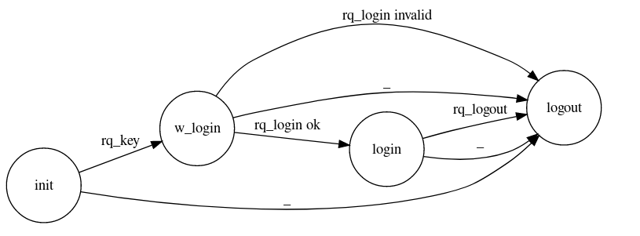
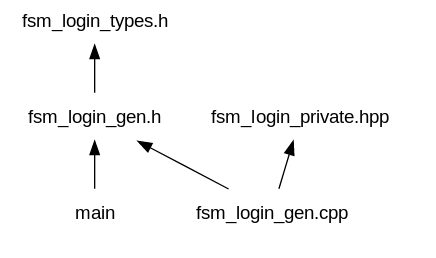
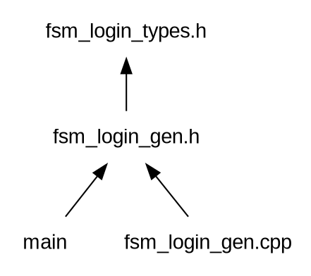

# FSM generator

## Installation

```bash
cargo install -f fsm_gen
```

You can download from repository and build and install as usual

```bash
cargo build --release
cargo install
```

## Versions

### 0.2

- Actions
- private hpp (hand file)
- Template functions to specialize on transaction change
- Anonymous `namespace` for functions

## TODO

- Add comments support on fsm grammar
- Add full proposed file for hand written .h and .cpp on generated one
- Negative guard transition???
- Support for multiple guards and actions
- Update idata in order to use ispush with btrees and more

- Complete the cpp example and update on README.md
- Check fsm format
  - inputs
  - all input per state, has to have a transition without guards
- output with signals

- Add languages

## Aim

All computing processes consist of receiving an input and processing it by generating an output. From the simplest to the most complex.

Sometimes, the process depends on the context and it is necessary to manage a state.

Messages and state management, therefore, are two fundamental elements of any software process.

That's why I wrote two external DSLs long time ago for both elements (which I still use in production and are a great help).

In this repository I rewrite one of them, the code generator for a state machine.

At the moment it generates C++ code (my most immediate target in production).

```
You can have data (fields) on inputs structs, and also on each status
```

To explain the system, I will use the example in [cpp_test/fsm](cpp_test/fsm)

This example is about writing a system that will handle login requests.

First the server will be asked for a password.

This key will be used to encode the username and password (this one will be passed through a hash function) in the login request.

This encoding will be irreversible (hash function). The server will perform the same operation (starting from the hash of the password) to verify the validity.

If it is OK, it will send a login confirmation.

The diagram would look like this:



A list of transitions could be written as:

```peg
[init]
    rq_key                      ->  w_login     /   send_key
    timer                       ->  init
    _                           ->  error

[w_login]
    rq_login    &   valid       ->  login       /   send_login
    rq_login                    ->  error
    timer       &   timeout     ->  error
    timer                       ->  w_login
    _                           ->  error

[login]
    rq_logout                   ->  logout      /   send_logout
    heartbeat                   ->  login       /   update_hb
    timer       &   timeout     ->  logout
    timer                       ->  login
    _                           ->  error

[logout]
    timer                       ->  logout
    _                           ->  error

[error]
    _                           ->  error
```

And this is the input for this tool to generate code

In fact, even the previous diagram has been generated from this `DSL` (it generated a `graphviz` dot file)

## Elements

### States

```peg
[init]
    ...
```

**init**, **w_login**, **login** ... are the states

Depending on the input and the state (with its values as will be seen later), the system will change to a new state.

### Transition

```peg
    rq_key                  ->  w_login
```

If we receive an input (in this case `rq_key`) we go to next state (`w_login`)

### Input

The elements received by the status machine.

```peg
    INPUT
      v
    rq_key                  ->  w_login
```

In the example they are **rq_key**, **rq_login**, **rq_logout**, **heartbeat** and **timer**.

### Guards

Functions that will be called depending on the status and input to decide the way forward.

```peg
                    GUARD
                     v
    rq_login    &   valid   ->  login       /   send_login
```

In the example we have **valid**, **timeout**, **ontime**.

All transitions can be replicated with different guards, but always one of
them has to be without guard (and the last one). Example:

```peg
    rq_login    &   valid   ->  login       /   send_login
    rq_login                ->  logout      /   log_err
```

### Final status

Behind the **->** arrow is the state we will change to.

```peg
                               FINAL_STATUS
                                   v
    rq_key                  ->  w_login
```

### Actions

We can define an action to be performed when executing a transaction.

This will be after the final state and '/'.

```peg
                                                ACTION
                                                  v
    rq_login                ->  logout      /   log_err
```

In this example we have **send_key**, **send_login**...

### Special transition

In all states it is necessary to consider all inputs.

But it is very common that many transitions are the same (generally error cases).

This is marked with the input \_

Consider the `init` status:

```peg
[init]
    rq_key                      ->  w_login     /   send_key
    timer                       ->  init
    _                           ->  logout      /   log_err
```

\_ will be expanded to produce...

```peg
[init]
    rq_key                      ->  w_login     /   send_key
    timer                       ->  init
    rq_login                    ->  logout      /   log_err
    heartbeat                   ->  logout      /   log_err
    rq_logout                   ->  logout      /   log_err
```

Therefore considering all possible inputs in this state

## Usage

To get help...

```bash
fsm_gen --help
```

```
fsm_gen 0.1.1
jleahred <jleahred@gmail.com>

    Generate code from a simple fsm file
    To check the supported languages  --show_langs


USAGE:
    fsm_gen [FLAGS] [OPTIONS] [fsm_files]...

FLAGS:
    -d, --dot-graphviz    Generate graphviz dot file
    -h, --help            Prints help information
        --help-cpp        Give me some information about generating cpp files
    -s, --show-langs      Show supported languages generators
    -V, --version         Prints version information

OPTIONS:
    -l, --lang <lang>            Language to generate code (show available --show-langs) [default: cpp]
    -t, --threads <n_threads>    Number of threads to use. 0 means one per core [default: 0]

ARGS:
    <fsm_files>...    List of fsm files
```

The default language is `c++` (and at the moment the only one)

You can run:

```bash
fsm_gen login.fsm
```

And it will generate the `c++`

You can pass a list of `fsm` files

```bash
fsm_gen login.fsm  test/seller.fsm test/test2/lift.fsm
```

The code will be generated on same directory of original `.fsm` file

If your shell supports, it you could run...

```bash
fsm_gen **/*.fsm
```

## C++ code generation

Starting from the example `login.fsm` the system will create...

```
    fsm_login_gen.h
    fsm_login_gen.cpp
```

You don't have to modify these files.

You have to write your code
on next files...

```
    fsm_login_types.h
    fsm_login_private.hpp
```

These two files will be created if don't exist as a reference

A empty reference code for these two files will be added on `_gen` files as comments.

Files dependency:



### fsm_login_gen.h

Full code on [cpp_test/fsm/fsm_login_gen.h](cpp_test/fsm/fsm_login_gen.h)

We are informed on when it was created.

This file is the starting point to use or extend the generated status machine
in your program.

```cpp
//  generated automatically  2019-03-22 11:24:40
//  do not modify it manually
```

Headers and `namespaces` based on filename

```cpp
#ifndef FSM_FSM_LOGIN_GENERATED_H
#define FSM_FSM_LOGIN_GENERATED_H

#include <iostream>
#include <memory>

namespace login {
```

Internal class forward declaration

```cpp
class BaseState;
typedef std::shared_ptr<BaseState> SState;
```

The `fsm` class you have to instantiate or extend

```cpp
//  -------------------
//      F S M
class Fsm {
public:
  Fsm();
  ~Fsm();

  void in(const heartbeat_t& in);
  void in(const rq_key_t& in);
  void in(const rq_login_t& in);
  void in(const rq_logout_t& in);
  void in(const timer_t& in);

  ...
}
```

### fsm_login_gen.cpp

Full code on [cpp_test/fsm/fsm_login_gen.cpp](cpp_test/fsm/fsm_login_gen.cpp)

You must not modify this file, and it's not necessary to know much about it

### fsm_login_types.h

Full code on [cpp_test/fsm/fsm_login_types.h](cpp_test/fsm/fsm_login_types.h)

In this file you have to declare the status info types, and input types

If the file doesn't exist, it will be created with empty data types

```cpp
//  Code generated automatically to be filled manually
//  This file will not be updated by generator
//  It's created just the first time as a reference
```

On `namespace` based on fsm file, we have the two types to declare

You can, of course, complete these types on cpp file if necessary

```cpp
namespace login {

  //  status info types
  struct st_init_t{};
  struct st_w_login_t{};
  struct st_login_t{};
  struct st_logout_t{};
  struct st_error_t{};


  //  input types
  struct in_heartbeat_t {};
  struct in_rq_key_t {};
  struct in_rq_login_t {};
  struct in_rq_logout_t {};
  struct in_timer_t {};


} // namespace login
#endif // FSM_LOGIN_H
```

### fsm_login_private.hpp

Full code on [cpp_test/fsm/fsm_login_private.hpp](cpp_test/fsm/fsm_login_private.hpp)

This is the other file you have to maintain by hand.

```cpp

//  Code generated automatically to be filled manually
//  This file will not be updated by generator
//  It's created just the first time as a reference

//  This file will be included in _gen.cpp
//  (anywhere else)

//  to make happy some IDEs
#include "fsm_login_types.h"
#include "fsm_login_gen.h"

namespace {
    using namespace login;
```

As you can see, it is on anonymous `namespace`.

This file is private, it will be included by `_gen.cpp`. Defining an anonymous
`namespace`, we keep this implementation as private. Even more important, the compiler
will alert us if we forget an implementation, also if one is not necessary.

Log and status change transitions are templates.

This is a log example:

```cfg
[init] rq_key -> w_login
[w_login] rq_login(valid) -> login
[login] rq_logout -> logout
```

In this way, you can specialize or generalize as much as you want.

```cpp
    //  log
    template <typename IN, typename INIT_ST, typename END_ST>
    void log(const std::string &txt_trans, const IN &, const INIT_ST &,
            const END_ST &) {
        std::cout << txt_trans << std::endl;
    }

    //  status change functions
    template <typename FROM, typename IN> st_init_t from_in2init(const FROM&, const IN&) { return st_init_t{}; }
    template <typename FROM, typename IN> st_w_login_t from_in2w_login(const FROM&, const IN&) { return st_w_login_t{}; }
    template <typename FROM, typename IN> st_login_t from_in2login(const FROM&, const IN&) { return st_login_t{}; }
    template <typename FROM, typename IN> st_logout_t from_in2logout(const FROM&, const IN&) { return st_logout_t{}; }
    template <typename FROM, typename IN> st_error_t from_in2error(const FROM&, const IN&) { return st_error_t{}; }
```

First parameter in log, is an string with transition change information (initial transition, input, guard if so, final transition)

Next, we have the guards and actions functions.

```cpp
    //  guards
    bool valid(const in_rq_login_t& /*in*/, const  st_w_login_t& /*st_info*/) { return true; }
    bool timeout(const in_timer_t& /*in*/, const  st_w_login_t& /*st_info*/) { return true; }
    bool timeout(const in_timer_t& /*in*/, const  st_login_t& /*st_info*/) { return true; }


    //  actions
    void act_send_key(const st_init_t& /*st_orig*/, const in_rq_key_t& /*in*/, const  st_w_login_t& /*st_dest*/) {}
    void act_send_login(const st_w_login_t& /*st_orig*/, const in_rq_login_t& /*in*/, const  st_login_t& /*st_dest*/) {}
    void act_send_logout(const st_login_t& /*st_orig*/, const in_rq_logout_t& /*in*/, const  st_logout_t& /*st_dest*/) {}
    void act_update_hb(const st_login_t& /*st_orig*/, const in_heartbeat_t& /*in*/, const  st_login_t& /*st_dest*/) {}


} // namespace anonymous
```

## Diagrams source


