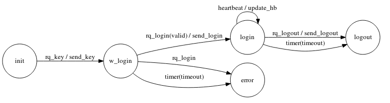

# FSM generator

## Installation

```bash
cargo install -f fsm_gen
```

You can download from repository and build and install as usual

```bash
cargo build --release
cargo install --path . -f
```


## TODO


- revisit dot
- generate mermaid
- check README.md

- Error transition is special
- Inprove exceptions control
- web ui for templates
- read template from file

- Complete the cpp example and update on README.md
- Check fsm format
  - detect duplicated states
  - detect duplicated inputs and guards
- output with signals

- Add new templates

## Versions

### 0.8
- Added adapters (aka transformers)
- New cpp generator with no c++ template<> code
- cpp template with CamelNames for structs
- "_" special final state

### 0.7

- Modifs on `cpp` generated code
    - Removed `.reference` files
    - Added `_forwards` files
    - `gen_` at the begining to indicate you souldn't touch
    - `actions` and `guards` using `cpp templates`
- Better `.dot` generated diagrams
- cpp
    - Removed shadow warning
    - Removed no virtual destructor

### 0.6

- `cpp` generated code with option to move to `error` state
- Instead of `languages`, now we speak about `templates`

### 0.5

- moved to tera templates
- added dot files generation
 
### 0.4

- error redefinied action on cpp (watch example iceberg)
- fix error when running on current directory
- Add full proposed file for hand written .h and .cpp on generated one

### 0.3

- multiline guards with no status name
- multi guard and multi actions
- '\_' on input means any other input
- negative guards
- if no transition, it will generate an error
- updated rust-peg lib and working with macros
- if execption is throwed, we will go to error transition
- better error information
  - on parsing show line
  - check orphans status
- makefile install, test cpp

### 0.2

- Actions
- private hpp (hand file)
- Template functions to specialize on transaction change
- Anonymous `namespace` for functions
- Add comments support on fsm grammar


## Objective

All computer systems interact with the external world by receiving information, processing it, and generating a result.

In addition to communicating with the outside world through `input/output`, it is common for a system to manage a `state`.

These two elements are fundamental in computer systems.

That's why I developed two external DSLs (for data and states) several years ago to simplify working with these concepts (which I still use in production and find very helpful).

In this repository, I have rewritten one of them: a code generator for state machines.

Currently, it generates C++ code (the most practical to me at the moment ;-).

To explain the system, I will use the example in [cpp_test/fsm](cpp_test/fsm).

This example is about building a system that handles login requests.

The _state_ diagram would look like this:



First, the client will require a key to send a request login with a coded password.

This key will be used to encrypt the username and password (the password will go through a hash function) in the login request.

This encryption is irreversible (hash function). The server will perform the same operation (starting from the password hash) to verify its validity.

If it is correct, a login confirmation will be sent.

The DSL representation of this definition would be:

```fsm
// Example of an FSM for managing login
// on the server side

[init]
    rq_key              ->  w_login     /   send_key           // this is a comment
    timer               ->  init

[w_login]
    rq_login
        &  ok           ->  login       /   send_login
                        ->  error
    timer
        & timeout       ->  error
                        ->  w_login
[login]
    rq_logout           ->  logout      /   send_logout
    heartbeat           ->  login       /   update_hbr
    timer
        & timeout       ->  logout
                        ->  login

[logout]
    timer               ->  _
    _                   ->  testing     /   send_logout

[error]
    _                   ->  error

```

This program also generates the displayed diagram before using the `DSL`.


## Elements

Let's now break down the elements that define a state machine.

A state machine specifies the states and transitions based on the received inputs.

### State

The machine is always in a state, and for each received input and the contextual information of the current state, we transition to another state, potentially performing some actions.

Therefore, in each state, there will be specific contextual information associated with that state.


### Transition

```fsm
[w_login]
    rq_login            ->  login       /   send_login
```

Starting from the state w_login, if we receive the login request, we transition to the state login and send the login confirmation (send_login).

In this simple transition, we can see the basic elements:


```fsm
initial estate
    v
[w_login]

      INPUT                FINAL STATE         ACTION
        v                     v                  v
    rq_login            ->  login       /   send_login
```


### Initial State


```fsm
[init]
```

* Enclosed in brackets
* At the beginning of the line

### Input

Received element

```fsm
[w_login]

      INPUT
        v
    rq_login            ->  login       /   send_login
```


### Final State

```fsm
[w_login]

                         FINAL STATE         
                              v                   
    rq_login            ->  login       /   send_login
```

Where the machine will be positioned for processing the next _input_


### Action

```fsm
[w_login]

                                             ACTION
                                               v
    rq_login            ->  login       /   send_login
```

In addition to transitioning to the new state, we can specify what action/effect to do on each transition

Multiple actions can be define for each transition by separating them with spaces


```fsm
[w_login]
    rq_login            ->  login       /   send_login   write_log
```


### Guards

Guards are used to define different paths based on the state information and input

```
                    GUARD
                     v
    rq_login    &   ok   ->  login       /   send_login
``` 

You can have more than one guard.

```
                    GUARD      GUARD
                     v           v
    rq_login    &   ok   &  system_ready  ->  login       /   send_login
```

For an input, you can for using several guards to generate different transitions

When last transition doesn't have guard, behave as _else_

```
    rq_login
        &   valid   ->  login       /   send_login
                    ->  logout      /   log_err
```

You can use negation with guards

The previous example could be written with a negative guard.

```
    rq_login
           NEGATED GUARD
            v
        &   !valid  ->  logout      /   log_err
                    ->  login       /   send_login
```

### Special input

In the following transition, we have a special input "_":

```fsm
[logout]
    _                   ->  testing     /   send_logout
    ^
  SPECIAL INPUT
```

The symbol "_" will be used to indicate that a transition should be generated with the rules defined in this one for each unspecified input.

### Special final state

```fsm
[logout]
    timer               ->  _
                            ^
                          SPECIAL FINAL STATE

    _                   ->  testing     /   send_logout
```

A final state with the symbol "_" indicates that there is no change in state.

Not only do we stay in the same state, but the state's context data remains unchanged.

### error status and implicit transitions


`error` is a special status

You can move to `error` status explicitly as any other normal status

But any transition no defined, will finish on error status.

You can also put some verifications on transiction funcion, and incase
of fail, you can move to error (even when is not explicitly writted on `fsm`)

This is so, because checking the params, is so commont that adding guards for it, would generate a lot of noise


In our example...

```fsm
[init]
    rq_key          ->  w_login     /   send_key
    timer           ->  init
```

There are no transations for `rq_login` and `rq_logout`. Both are implicit and is
equivalent to...

```fsm
[init]
    rq_key          ->  w_login     /   send_key
    timer           ->  init
    _               ->  error
```


### Adapters

aka _transformers_

Adapters can be placed at the input, guards, and transition levels.

In the case of transitions, they will be placed in the final state.

```fsm
                                                           ADAPTER
[init]                                                        v
    rq_key                      ->  w_login     /   send_key|rq
    timer                       ->  init
    _                           ->  logout      /   log_err


```

The adapters will help us extract common functionalities, reducing the number of functions to be filled manually, or adding context information to make the generated code more readable.

```fsm
                ADAPTER                   ADAPTER             ADAPTER
[init]             v                         v                   v
    rq_key    &ok|rq            ->  w_login|rqok    /   send_key|rq
    timer                       ->  init
    _                           ->  logout          /   log_err


```


### Comments

Comments start with // and continue until the end of the line.


## Usage

To get help...

```bash
fsm_gen --help
```

```fsm
> fsm_gen -h


fsm_gen 0.8.0

    Generate code from a simple fsm file
    To check the supported templates  --show_templs
    

USAGE:
    fsm_gen [FLAGS] [OPTIONS] [fsm-files]...

FLAGS:
    -d, --dot-graphviz    Generate graphviz dot file
    -f, --force           Generate all files regardless of change date. DANGEROUS!!!
    -h, --help            Prints help information
        --help-cpp        Give me some information about generating cpp files with no templates to fill
    -s, --show-templs     Show supported template generators
    -V, --version         Prints version information

OPTIONS:
    -T, --threads <n-threads>    Number of threads to use. 0 means one per core  ;-) [default: 0]
    -t, --templ <templ>          Template to generate code (show available --show-templs) [default: cpp]

ARGS:
    <fsm-files>...    List of fsm files to be processed

```

The default template is `cpp` (for c++) (and at the moment the only one)


```bash
fsm_gen --help
```

```fsm
> fsm_gen --show-templs

Supported templates:   cpp 

```


```bash
fsm_gen --help
```


Help about cpp template...

```fsm
> fsm_gen --help-cpp

Being "name.fsm" the name of the file with the definition of the machine, next files an directories will be generated

All will be generated on directory...

    fsm_<name>/


    Main entry point. Do not modify, it will be rewritting on each execution
        <name>.h
        <name>.cpp

    Types
        <name>_types.h                      (to be filled manually)
        <name>_types_reference.h            (just as reference)
        <name>_types_adapters_fordward.h    (forward declaration and reference)
        <name>_types_adapters.h             (to be filled manually)

    Support functions.
    You shouldn't mofify headers and you have to fill  .cpp

        impl/log.hpp

        impl/guards.h
        impl/guards.cpp

        impl/actions.h
        impl/actions.cpp
        
        impl/transitions.h
        impl/transitions.cpp


```


To generate code...  run

```bash
fsm_gen login.fsm
```

And it will generate the `c++`

You can pass a list of `fsm` files

```bash
fsm_gen login.fsm  test/seller.fsm test/test2/lift.fsm
```

The code will be generated on same directory of original `.fsm` file

If your shell supports it, you could run...

```bash
fsm_gen **/*.fsm
```

## C++ code generation

It will also generate the files _types.h_, _types_adapters.h_, and _types_forward.h_.

The _types_reference.h_ file serves as a reference for everything generated in the types files.

The _types.h_ file is initially created and will not be overwritten in subsequent executions.

This file will be used to customize the "types".

Directories/modules will be created for 

    impl
        actions
        guards
        transitions


The header files will be rewritten and will help avoid "dead code" and provide the new functions to be filled in.

`transitions`, `guards` and `adapters` should be pure, no effects

* `transitions` will return the new transition with provider parameters (from status, intput)
* `guards`: will return true or false with current status and input
* `adapters` will return a new type using the parameters where the adapter is applied
* `actions`with initial transition status, the input and the final status, we have the oportunity to do something (in general, produce an _effect_)

When an `adapter` is applied to a `transition`, `guard`, or `action`, the parameter will be the `adatpter` type


The `adapters` will be C++ structs with constructors based on the context.

In these types, we have the opportunity to add direct or processed information.

The adapters will help us extract common factors, reducing the number of functions to be filled in, or add context information to make the generated code more readable.


